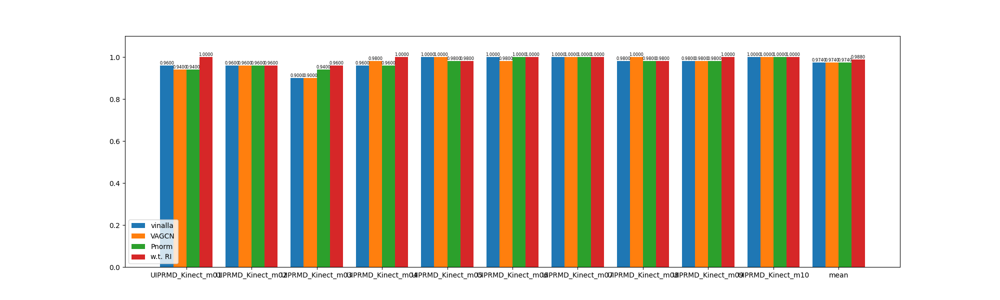
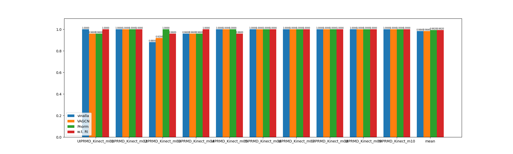
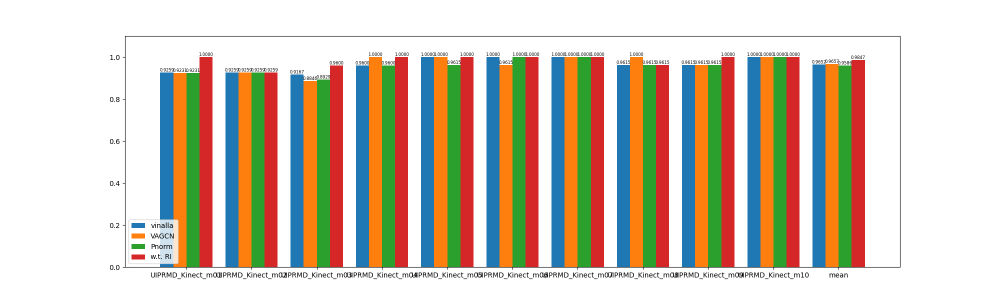
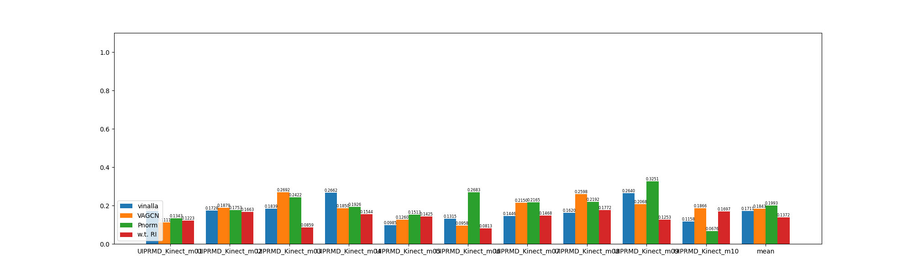

# Rehabilitation Exercise Assessment

This repository is the official implementation of the paper [A Skeleton-based Rehabilitation Exercise Assessment System with Rotation Invariance](https://ieeexplore.ieee.org/document/10144079), which has been published at TNSRE 2023. 

## Environment

This project is written in `Python 3.7.11` and the following is the list of necessary packages and their versions. 

```
pytorch=1.8.0+cu111
scikit-learn=1.0.2
scipy=0.7.3
opencv-python=4.5.4
matplotlib=3.5.1
seaborn=0.11.2
PyYAML=6.0
```

## Dataset

We conduct our experiments on three datasets: the IRDS and UI-PRMD datasets, and our push-up dataset.

1. The IRDS dataset can be downloaded from [its official website](https://zenodo.org/record/4610859#.Y2Z4kctBxJB). 

2. The UI-PRMD dataset can be downloaded from [its official website](https://webpages.uidaho.edu/ui-prmd/). As the original data is in the form of `Angles` and `Positions`, we transform them into `Skeletons` data and the preprocess code is in [preprocess.py](mvn/datasets/preprocess.py)

3. The push-up dataset can be downloaded from our [Google Drive](https://drive.google.com/drive/folders/1bWsc6TOzMfSkGd31OLtXDOvSn1ut5OEk?usp=sharing).

The datasets should be downloaded to `./data` directory and should be structured as following.

```
|-- data
    |-- IRDS
        |-- Simplified
            |-- 101_18_0_1_1_stand.txt
            |-- 101_18_0_2_1_stand.txt
            |-- ...
            |-- 307_18_8_12_1_stand.txt
    |-- PushUp
        |-- S1
            |-- 202112291345
                |- keypoints_3d.npy
                |- labels.txt
            |-- ...
        |-- ...
        |-- info.CSV
    |-- UI-PRMD
        |-- Correct
            |-- Kinect
                |-- Angles/
                |-- Positions/
                |-- Skeletons
                    |-- m01_s01_e01.txt
                    |-- m01_s01_e02.txt
                    |-- ...
                    |-- m10_s10_e10.txt
            |-- Vicon/
        |-- Incorrect/
```

## Checkpoints

The pretrained models can be downloaded from our [Google Drive](https://drive.google.com/drive/folders/118T2tfCaQSCBm948BQibh5amVJTCltXI?usp=sharing) and should be put into `./logs` directory. The files should be structured as following. 

```
|-- logs
    |-- IRDS_GCN_none_seed1
        |-- IRDS_m01
            |-- model.pth
        |-- ...
        |-- result.yaml
    |-- ...
```

## Train

To train the model from scratch, you can run the following command.

```
python train.py [--model MODEL] [--dataset DATASET] [--Pnorm]

--model    which model is used    choose from [gcn, va-gcn, ri-gcn]
--dataset  which dataset is used  choose from [IRDS, UIPRMD_Kinect, UIPRMD_Vicon, PushUp]
--Pnorm    whether to normalize the orientation according to pelvis
```

Specifically, here are the commands for running different models.

```
# vanilla ST-GCN
python train.py --model gcn [--dataset DATASET]
# Pnorm
python train.py --model gcn [--dataset DATASET] --Pnorm
# VA-GCN
python train.py --model va-gcn [--dataset DATASET]
# GCN w.t. RI
python train.py --model ri-gcn [--dataset DATASET]
```

## Inference

To inference a pretrained model, run this command.

```
python inference.py [--model MODEL] [--dataset DATASET] [--aug_angle AUG_ANGLES] [--vis]

# e.g. to evalute model under rotational disturbance

python inference.py --model ri-gcn --dataset PushUp --aug_angle 0 10 20 30 40 50 60 70 80 90
```

## Results

Comparisons on the accuracy, recall, precision and OvR metrics can be plotted using code in [plot_result.py](plot_result.py). For example, here are the bar charts of accuracy, recall, precision and OvR on the UIPRMD_Kinect respectively, which is the same as is reported in our paper. 









## Contact

Email: zkl22@mails.tsinghua.edu.cn
